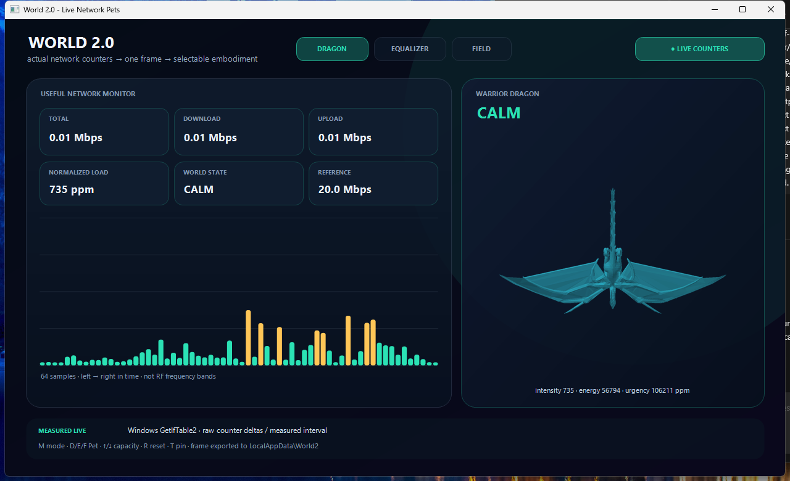
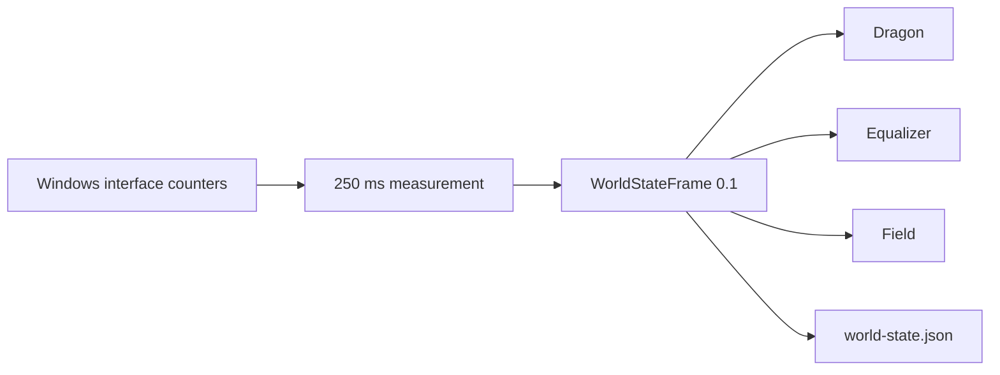
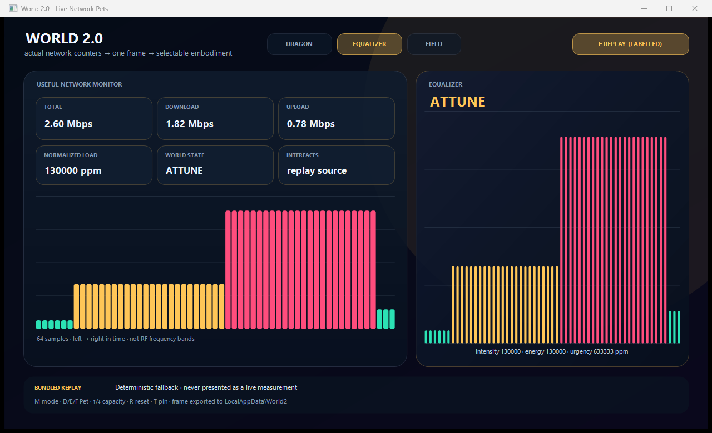

# WORLD 2.0 — Network → Motion

**Actual Windows network traffic becomes visible state and motion.** One native executable; no Python, browser, server, account, or external asset required.

[Download the Windows prototype](https://github.com/serg-alexv/hme/releases/download/world2-network-dragon-v0.1.0/World2NetworkDragon.exe) · [Release and checksum](https://github.com/serg-alexv/hme/releases/tag/world2-network-dragon-v0.1.0) · [What is verified](STATUS.md)



## Verify it in 60 seconds

1. Download and run `World2NetworkDragon.exe` on Windows x64.
2. Start a download, upload, or speed test.
3. Watch the measured Mbps, normalized load, and state change.
4. Switch between **Dragon**, **Equalizer**, and **Field**. Every view consumes the same live frame.

The prototype is unsigned, so Windows may show SmartScreen. Verify the SHA-256 before running:

```text
b2107825ff8d582fb0f23a9f099c943f2cf036bdf0f125fd0c589e57b8d194d7
```

## What is happening



The producer owns measurement, normalization, state, provenance, and integrity. An embodiment consumes the finished frame; it does not reinterpret the network.

Real traffic changes:

- `CALM`, `ATTUNE`, and `STORM` state;
- bounded intensity, energy, and urgency values;
- dragon breathing and programmatic wing motion;
- equalizer and field animation;
- the exported `%LOCALAPPDATA%\World2\world-state.json` frame.

Controls: `D` Dragon · `E` Equalizer · `F` Field · `M` Live/labelled replay · `↑`/`↓` reference capacity · `R` reset · `T` always on top.



## Supported signals

**The current release measures data flow, not physical radio waves.**

| Input | Status | Exact meaning |
|---|---|---|
| Aggregate host download/upload | **Live and verified** | Byte-counter deltas from connected, operational, non-loopback Windows interfaces |
| Recorded throughput replay | **Verified and visibly labelled** | Bundled deterministic fallback; never presented as live measurement |
| Connected-WLAN link metrics | Not in this executable | Separate adapter direction; not a room-wide measurement |
| RF spectrum / Wi-Fi CSI | Not implemented | Requires suitable sensor hardware and an independent validation gate |
| Camera floor/position | Not implemented here | Future spatial-registration input, separate from network measurement |

The app does **not** inspect packets, identify people, infer location, measure RF energy, or read Wi-Fi CSI. See the [claims register](CLAIMS.md) for the exact public boundary.

## Current dragon, precisely

Version `0.1.0` uses embedded 2D dragon state art plus programmatic wings and breathing. It proves the live **measurement → state → embodiment** path. It is **not** the pending rigged-FBX skeletal-animation runtime.

The same `WorldStateFrame` contract is intentionally renderer-neutral. A later consumer can drive FBX bones, shader uniforms, audio, particles, a browser pet, or a physical actuator without moving network interpretation into that consumer.

## Short roadmap

1. Drive real rigged-FBX clips, bones, and shader parameters from the existing frame contract.
2. Add more selectable creatures and materials without duplicating telemetry logic.
3. Add camera floor anchoring, then separately validated RF/CSI sensor adapters.

No item above is described as released until its runtime test and evidence are public.

## Build and inspect

- [Windows source and build instructions](frontier/world-engine-v0.1/windows-live/README.md)
- [Frozen state contract](frontier/world-engine-v0.1/schemas/world-state-0.1.schema.json)
- [System architecture](architecture/SYSTEM.md)
- [Privacy boundary](docs/PRIVACY.md)
- [Validation status](STATUS.md)

## Foundational constraints

The development rules draw from two deliberately adversarial references: Google Workspace's *Assured Controls* and the IDC/Red Hat *Digital Sovereignty in Action* InfoBrief. They are used for control, portability, provenance, resilience, and oversight—not as independent validation of this project. Read the mapped principles in [Foundational and Adversarial Reading](docs/FOUNDATIONAL_READING.md).
