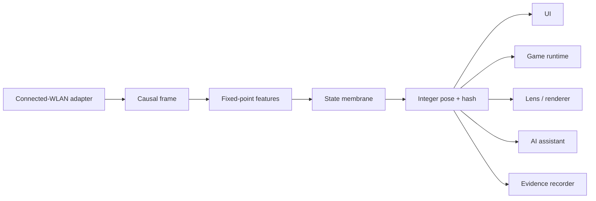

# World 2.0 runtime contracts

## Purpose

World 2.0 separates mathematical authority from human-facing interaction. That separation gives `0Math` two deliberate meanings:

1. **No math required in an experience runtime.** A player, designer, UI user, or assistant can see, click, play, inspect, and explain the result without reading equations.
2. **Math-only in the authority runtime.** The signal-to-feature-to-state-to-pose path is deterministic, versioned, and independent of AI or renderer improvisation.

These meanings apply to different runtimes and task sets. They are complementary, not interchangeable.

## Naming contract

| Name | Meaning | User-facing? |
|---|---|---:|
| World 2.0 | the whole research and engineering project | yes |
| WorldMath | normative mathematical and execution specification | technical |
| WorldEngine | executable implementations and application variants | technical or user-facing by product |
| `world.pose/0.1` | current machine protocol namespace | machine-only |

Repository governance is not a separate product brand. Renaming a machine protocol requires a versioned migration and new evidence bytes.

## End-to-end boundary



Only the left-to-right authority path may produce the authoritative state and pose. Consumers may interpret the emitted contract for their own task, but they may not rewrite its provenance, features, state, pose, or hash.

## Runtime permission matrix

| Runtime | Input | Permitted tasks | Output | Forbidden authority |
|---|---|---|---|---|
| Sensor adapter | platform measurement API | acquire, timestamp, validate, mark freshness | causal frame | infer game state or person state |
| Math-only kernel | causal frame + fixed configuration | derive bounded features, apply dwell/hysteresis, emit pose, hash | pose frame | hidden randomness, AI-generated state, renderer-specific logic |
| Evidence recorder | raw/derived frames + config | preserve bytes, counts, versions, hashes, results | experiment bundle | reconstruct missing raw evidence |
| UI | pose/evidence | render, scrub, select, compare, expose provenance | visible inspection state | reclassify or relabel source |
| Game runtime | pose/evidence | map state to mechanics, scoring, rewards, hazards | game events | claim a game mapping is a physical measurement |
| Renderer | pose frame | resolve bones, convert integer units, apply motion | pixels/transforms | generate authoritative waves or behavior |
| AI assistant | read-only evidence or an explicit authoring task | explain, compare traces, draft mappings/config changes | explanation or reviewable proposal | participate in the deterministic fast loop |

## Interaction mappings

The same verified state can support different application semantics:

| Verified state | Example UI behavior | Example game behavior | Safety behavior |
|---|---|---|---|
| CALM | low-motion display | baseline traversal | normal scoring |
| ATTUNE | highlight a change | reveal a path | retain provenance |
| STORM | emphasize high activity | charge a bounded hazard | do not call it physical danger |
| STALE | show source loss | pause scoring | never imply live measurement |

These are application mappings. They are not scientific claims about the environment.

## What is currently detectable

Allowed exact statement:

> The host computer's active connected-WLAN telemetry.

Explicit exclusions:

- CSI;
- room-wide RF imaging;
- spectrum occupancy;
- occupancy or pose;
- physiology;
- identity.

## Cross-platform meaning

The portable object is the versioned causal/pose/evidence contract. A claim that the contract is portable does not prove that every platform exposes the same live sensor.

Every platform or app requires an adapter acceptance test:

```text
platform measurement or replay
→ declared source class
→ schema-valid frame
→ deterministic kernel
→ consumer-specific mapping
→ preserved evidence
```

Browser and mobile demos may use `SIMULATED` or `RECORDED_REPLAY` when live transport is unavailable. They must say so visibly.

## AI boundary

AI assistance is useful outside the fast loop for:

- explaining why a state changed;
- locating the first divergent frame or field;
- proposing game/UI mappings;
- drafting a configuration change;
- comparing experiments;
- helping an operator inspect evidence.

An AI-generated configuration is not accepted merely because it is plausible. It requires a new version, deterministic replay, tests, evidence, and the repository's human review.

## Privacy boundary

See [PRIVACY.md](PRIVACY.md). The current emitted contract does not require or emit SSID, BSSID, packet payload, account identity, or person identity.
